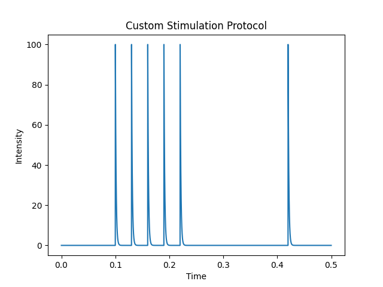
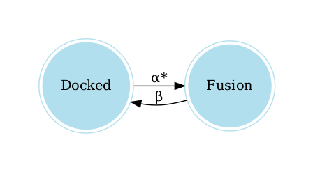

# Dynamics of Neuromuscular Transmission Reproduced by Calcium-Dependent and Reversible Serial Transitions in the Vesicle Fusion Complex

## Python implementation of the kinetic model of neuromuscular transmission dynamics.


[](
https://www.frontiersin.org/articles/10.3389/fnsyn.2021.785361)

---

**Source Code**: <a href="https://github.com/alexini-mv/kinetic-neurotransmission" target="_blank">https://github.com/alexini-mv/kinetic-neurotransmission</a>

---

## Requirements

- Python >= 3.6
- graphviz
- matplotlib
- numpy
- pandas

To use the graph display functions of the model, it is necessary to install the Graphviz library as described in the follow [documentation](https://graphviz.org/download/).


## Installation

- Clone this project [repository](https://github.com/alexini-mv/kinetic-neurotransmission) to your local workspace. 
- Create a new Python Virtual Environment with either [venv](https://docs.python.org/3/library/venv.html) or [conda](https://docs.conda.io/projects/conda/en/latest/user-guide/tasks/manage-environments.html).
- Install the required libraries from the file `requeriments.txt` into your virtual environment. 

You are ready to use our package.

## Example

### Creating a Model

Create a file `main.py` importing the following classes:

```python
from kineuron import KineticModel, TransitionState, Transition
from kineuron import RateConstant, Stimulation, Solver
``` 

After, instance the model objects as follows:

```python
model = KineticModel(name='my-model', vesicles=100)

docked = TransitionState(name='Docked')
fusion = TransitionState(name='Fusion')

alpha = RateConstant(name="α", value=0.3, calcium_dependent=True)
beta = RateConstant(name="β", value=15)

tr1 = Transition(name='Transition 1', rate_constant=alpha, origin={"Docked": 1}, destination={"Fusion": 1})
tr2 = Transition(name='Transition 2', rate_constant=beta, origin={"Fusion": 1}, destination={"Docked": 1})
```

Add all objects to the model as follows:

```python
model.add_transition_states([docked, fusion])
model.add_rate_constants([alpha, beta])
model.add_transitions([tr1, tr2])
```

Finally initialize the model:
```python
model.init()
```

Likewise, a stimulation protocol should be defined (if the experiment requires it) as follows:

```python
protocol = Stimulation(
     conditional_stimuli=5,
     period=0.03,
     time_start_stimulation=0.1,
     tau_stimulus=0.0013,
     time_wait_test=0.2,
     intensity_stimulus=100.0,
     type_stimulus='exponential_decay', 
     name="Custom Stimulation Protocol")
```

The following lines show the time profile of the stimulation protocol:

```python
import numpy as np

t = np.arange(0, 0.5, 0.0001)
protocol.plot(t)
``` 

<p align="center">

</p>


### Model Information (Optional)

General model information can be obtained as follows:
```python
model.get_info()
```
and running the file main.py:


```console
$ python main.py 

================ MODEL INFORMATION ================
MODEL NAME:	my-model
TOTAL VESICLES:	100

TRANSITION STATES - VESICLES
Docked	:	100
Fusion	:	0
----------------------------------------------------
NAME:		Transition 1
RATE CONSTANT NAME:	α
RATE CONSTANT VALUE:	0.3 s⁻¹
CALCIUM-DEPENDENT:	True
ORIGIN:		{'Docked': 1}
DESTINATION:	{'Fusion': 1}
----------------------------------------------------
NAME:		Transition 2
RATE CONSTANT NAME:	β
RATE CONSTANT VALUE:	15 s⁻¹
CALCIUM-DEPENDENT:	False
ORIGIN:		{'Fusion': 1}
DESTINATION:	{'Docked': 1}
====================================================
```

The following lines allow you to visualize the graph of the model:

```python
graph = model.get_graph()
graph.view()
```

<p align="center">

</p>


### Run It

The Solver object that simulates the time evolution of the model must be instantiated. Here we use a implementation of the [Gillespie Stochastic Algorithm (1977)](https://doi.org/10.1021/j100540a008).

```python
experiment = Solver(model=model, stimulation=protocol)
```

Before starting the simulation, be sure to find the _**resting state**_ of the model, from which all experiments will start. This is accomplished as follows:

```python
experiment.resting_state()
```

With the following lines the experiment is run. The results can be obtained and saved in a `.csv` file for further analysis.

```python
experiment.run(repeat=1)
results = experiment.get_results(mean=True)
results.to_csv("results.csv", index=True)
```

Finally, the `main.py` file is executed to perform the complete simulation:
```console
$ python main.py
```

## Reference
If you use our code for your research, we kindly ask you to cite our work as follows:

* Martínez-Valencia. A, Ramírez-Santiago. G, De-Miguel, F. F. (2022). Frontiers in Synaptic Neuroscience. URL: https://www.frontiersin.org/articles/10.3389/fnsyn.2021.785361
